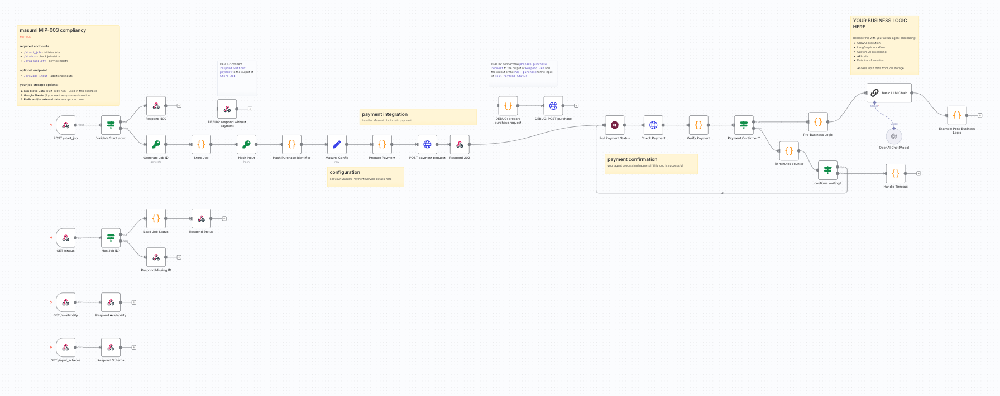

# Masumi n8n Paywall Template

## Overview

This repository contains a **webhook-based n8n workflow template** that implements a paywall pattern using the Masumi payment system. Unlike custom node solutions, this template uses only **native n8n nodes** (webhooks, HTTP requests, code nodes) - making it compatible with any n8n instance without requiring custom node installation.

The template implements [MIP-003](https://github.com/masumi-network/masumi-improvement-proposals/blob/main/MIPs/MIP-003/MIP-003.md) compliance through webhook endpoints, creating a complete AI agent service that can be monetized with Cardano blockchain payments.



## Repository Contents

- **`Masumi_n8n_Paywall_Flow_no_vars.json`** - The main n8n workflow template to import
- **`n8n_workflow_replica.py`** - Python script that replicates the workflow for testing/debugging  
- **`.env.example`** - Example configuration file for the replica script
- **`requirements.txt`** - Python dependencies for the replica script

## Quick Start

### 1. Deploy Masumi Payment Service

**Before setting up the n8n workflow, you must have access to your own Masumi Payment Service.** This service is required to:
- Register your agent and connect it to a seller account
- Handle all blockchain interactions and payment processing
- Manage payment requests and status polling

This example uses <a href="https://railway.com?referralCode=pa1ar" target="_blank">Railway</a> templates. Railway is a cloud development platform that enables developers to deploy, manage and scale applications and databases with minimal configuration.

**Prerequisites:**
- <a href="https://blockfrost.io/" target="_blank">Blockfrost</a> API key (free tier is enough)
- <a href="https://railway.com?referralCode=pa1ar" target="_blank">Railway account</a> (free trial is 30 days or $5, more than enough for testing)

**Deploy Payment Service:**

[](https://railway.com/deploy/masumi-payment-service-official?referralCode=padierfind)

1. Click the deploy button above
2. Provide Blockfrost API key in variables (required to deploy)
3. Wait for deployment (takes 5 minutes or so)
4. You'll see 2 services: PostgreSQL database and Masumi Payment Service
5. Generate a public URL: Payment Service > Settings > Networking > Generate URL
6. Test at `/admin` or `/docs`. Your admin key is in the variables. **Change it in the admin panel.**

**Prepare for Agent Registration:**
1. Go to Payment Service admin panel at `/admin`
2. Top up selling wallet using <a href="https://dispenser.masumi.network/" target="_blank">Masumi tADA dispenser</a> (Preprod)
3. Top up your buying wallet (you'll need funds for testing payments)
4. Note your seller wallet verification key (vkey) from the admin panel
5. Copy your Masumi Payment Service URL (format: `https://your-service.railway.app/api/v1`)

**Important:** For testing purposes, this workflow shows payment from the same payment service instance. For production and selling services to real customers, refer to the full <a href="https://docs.masumi.network/" target="_blank">Masumi documentation</a> for instructions about selling on marketplaces like Sokosumi.

### 2. Set Up n8n

This template works with **any n8n instance** - no custom nodes required! You have several deployment options:

- **n8n Cloud**: Use [n8n cloud](https://n8n.io/cloud/) for fully managed hosting
- **Self-hosted**: Follow the [n8n installation guide](https://docs.n8n.io/hosting/)  
- **Railway Template**: Deploy n8n using Railway's template (can be added to same project as Payment Service)
- **Docker**: Use the official [n8n Docker image](https://hub.docker.com/r/n8nio/n8n)

### 3. Import the Workflow Template

1. Open your n8n instance
2. Go to **Workflows → Import from File** 
3. Upload `Masumi_n8n_Paywall_Flow_no_vars.json`
4. The template will appear in your editor with all required endpoints
5. Activate the workflow to generate webhook URLs

### 4. Configure the Masumi Config Node

Update the **"Masumi Config"** Set node with your specific values:

```json
{
  "payment_service_url": "https://your-masumi-payment-service/api/v1",
  "payment_api_key": "your-payment-service-api-key", 
  "agent_identifier": "your-registered-agent-id",
  "seller_vkey": "your-seller-wallet-verification-key",
  "network": "Preprod"
}
```

**Security Note**: For production, consider using n8n's environment variables or credentials system instead of hardcoding sensitive values.

### 5. Register Your Agent

1. Copy the `/start_job` webhook URL from n8n (found in the "POST /start_job" webhook node)
2. In your Masumi Payment Service admin panel, register an agent using this URL
3. Copy the generated agent identifier and update the "Masumi Config" node
4. Note your seller wallet verification key (vkey) and update the config

### 6. Test the Template

Test each endpoint to ensure proper functionality:

```bash
# Test availability
curl https://your-n8n-instance.com/webhook/availability

# Test input schema  
curl https://your-n8n-instance.com/webhook/input_schema

# Test job creation
curl -X POST https://your-n8n-instance.com/webhook/start_job \
  -H "Content-Type: application/json" \
  -d '{
    "identifier_from_purchaser": "test_user_123",
    "input_data": [
      {"key": "prompt", "value": "Hello world test"}
    ]
  }'

# Test status check (use job_id from previous response)
curl 'https://your-n8n-instance.com/webhook/status?job_id=YOUR_JOB_ID'
```


## Template Architecture

### MIP-003 Compliant Endpoints

This template implements all required MIP-003 endpoints using native n8n webhook nodes:

#### 1. **POST /start_job** - Job Creation & Payment Request
- **Purpose**: Creates a new job and payment request
- **Input**: `identifier_from_purchaser` and `input_data` array
- **Returns**: Payment details and job_id immediately
- **Process**: Validates input → Generates job ID → Creates payment request → Stores job → Returns payment data

#### 2. **GET /status** - Job Status Query  
- **Purpose**: Check current job status and retrieve results
- **Input**: `job_id` query parameter
- **Returns**: Job status, payment info, and results (when complete)
- **States**: `awaiting_payment` → `running` → `done` (or `failed`)

#### 3. **GET /availability** - Service Health Check
- **Purpose**: Confirms the agent is operational  
- **Returns**: Service availability status and metadata

#### 4. **GET /input_schema** - Input Format Specification
- **Purpose**: Returns expected input format for the agent
- **Returns**: Schema describing required and optional input parameters

### Core Components

#### **Configuration Management**
- **Masumi Config** node: Centralized configuration using n8n Set node
- Contains: Payment service URL, API keys, agent ID, seller vkey, network

#### **Job Storage System**  
- Uses **n8n Static Data** for persistent job storage across executions
- Jobs persist through n8n restarts and are immediately accessible after creation
- Each job tracks: ID, status, input data, payment details, results, timestamps

#### **Payment Integration**
- **Payment Request**: Creates payment via Masumi Payment Service API
- **Payment Polling**: Continuous monitoring for `FundsLocked` status (every 20 seconds)
- **Timeout Handling**: Automatic failure after 10 minutes of no payment

#### **Business Logic Integration**
- **Example Implementation**: Basic LLM Chain using OpenAI (replaceable)
- **Pre/Post Processing**: Structured data preparation and result storage
- **Extensible**: Replace LLM node with any business logic (CrewAI, LangGraph, etc.)

### Payment Flow Sequence

1. **Job Creation**: `/start_job` endpoint creates job and payment request
2. **Immediate Response**: Returns payment details without waiting for confirmation  
3. **Background Polling**: Automatic 20-second interval checks for payment status
4. **Payment Detection**: When `FundsLocked` status detected, job status changes to `running`
5. **Business Logic Execution**: Runs your custom processing (LLM, API calls, etc.)
6. **Result Storage**: Updates job with results and sets status to `done`
7. **Result Retrieval**: Client can fetch results via `/status` endpoint

### Customizing Business Logic

Replace the **"Basic LLM Chain"** node with your own logic:

**Option 1: Direct Replacement**
- Delete the LLM Chain and OpenAI Chat Model nodes
- Add your custom processing nodes (HTTP requests, data transformation, etc.)
- Ensure output connects to "Example Post-Business Logic" node

**Option 2: Workflow Integration**  
- Keep the payment infrastructure intact
- Replace business logic section with calls to other n8n workflows
- Use n8n's workflow trigger nodes for complex processing

**Option 3: External API Integration**
```javascript
// Example: Call external API in Code node
const input = $('Pre-Business Logic').first().json.formatted_prompt;
const response = await fetch('https://your-api.com/process', {
  method: 'POST',
  headers: { 'Content-Type': 'application/json' },
  body: JSON.stringify({ input: input })
});
const result = await response.json();
return [{ json: { result: result.output } }];
```

## Security & Production Considerations

### Webhook Security

**⚠️ Important**: Webhook endpoints are **publicly accessible** by default. For production deployment:

1. **Enable Authentication**: Use n8n's webhook authentication options
2. **Custom Validation**: Add authentication checks in workflow logic  
3. **API Key Headers**: Implement custom API key validation
4. **Rate Limiting**: Prevent abuse with request throttling
5. **Monitor Access**: Log and monitor webhook usage patterns

### Configuration Security

**Production Setup:**
```javascript
// Use n8n credentials or environment variables instead of hardcoded values
const config = {
  payment_service_url: $credentials.masumi.url,
  payment_api_key: $credentials.masumi.apiKey,
  agent_identifier: $vars.AGENT_ID,
  seller_vkey: $vars.SELLER_VKEY,
  network: $vars.NETWORK || "Preprod"
};
```

### Network Configuration

- **Private Networks**: Use Railway private networking when deploying both services
- **HTTPS Only**: Ensure all webhook URLs use HTTPS in production
- **Environment Separation**: Different URLs for development, staging, production

## Testing & Debugging

### Template Testing Steps

1. **Import & Configure**: Import template and update Masumi Config node
2. **Activate Workflow**: Ensure all webhook URLs are generated  
3. **Test Each Endpoint**: Use curl commands from setup section
4. **Monitor Execution**: Check n8n execution history for errors
5. **Verify Job Storage**: Use `/status` endpoint to confirm job persistence

### Debug with Python Replica

The included `n8n_workflow_replica.py` script replicates the workflow logic:

```bash
# Install dependencies  
pip install -r requirements.txt

# Configure environment
cp .env.example .env
# Edit .env with your values

# Run the test
python n8n_workflow_replica.py
```

**Debug Benefits:**
- Step-by-step execution visibility
- Request/response logging
- Payment flow troubleshooting
- Timing and signature validation

### Common Troubleshooting

| Issue | Solution |
|-------|----------|
| "Job not found" after creation | Check n8n static data storage, verify job ID generation |
| Payment polling not starting | Verify "Poll Payment Status" node connections and timing |
| "Invalid blockchain identifier" | Never modify payment service response timestamps |
| Webhook URLs not working | Ensure workflow is activated and webhooks are enabled |
| OpenAI API errors | Update credentials or replace with different LLM provider |

### Production Checklist

- [ ] Enable webhook authentication
- [ ] Replace hardcoded config with environment variables  
- [ ] Test full payment flow on Preprod network
- [ ] Monitor webhook access logs
- [ ] Set up payment failure notifications
- [ ] Verify job cleanup/archival strategy

## Key Advantages of This Template

### vs Custom n8n Nodes
- ✅ **No Installation Required**: Works with any n8n instance (cloud, self-hosted, Railway)
- ✅ **Immediate Deployment**: Import and configure in minutes
- ✅ **Full Transparency**: All logic visible and customizable in n8n editor
- ✅ **Easy Debugging**: Built-in n8n execution logs and error handling

### vs Python/FastAPI Agents  
- ✅ **Visual Workflow**: No-code/low-code approach with visual flow editor
- ✅ **Built-in Integrations**: Native n8n connectors for APIs, databases, LLMs
- ✅ **Rapid Prototyping**: Quick iterations and testing without code deployment
- ✅ **Job Management**: Built-in persistence and status tracking

## Resources & Links

- **[n8n Documentation](https://docs.n8n.io/)** - Complete n8n guide and reference
- **[Masumi Network Docs](https://docs.masumi.network/)** - Official Masumi documentation  
- **[MIP-003 Specification](https://github.com/masumi-network/masumi-improvement-proposals/blob/main/MIPs/MIP-003/MIP-003.md)** - Agent API compliance standard
- **[Masumi Payment Service](https://github.com/masumi-network/masumi-payment-service)** - Payment infrastructure
- **[Railway Deploy Button](https://railway.com/deploy/masumi-payment-service-official?referralCode=pa1ar)** - One-click payment service deployment

## Support & Community

- **Template Issues**: Use this repository's GitHub issues
- **n8n Support**: [n8n Community Forum](https://community.n8n.io/)  
- **Masumi Support**: [Discord Community](https://discord.gg/masumi)
- **Payment Service**: [GitHub Issues](https://github.com/masumi-network/masumi-payment-service/issues)